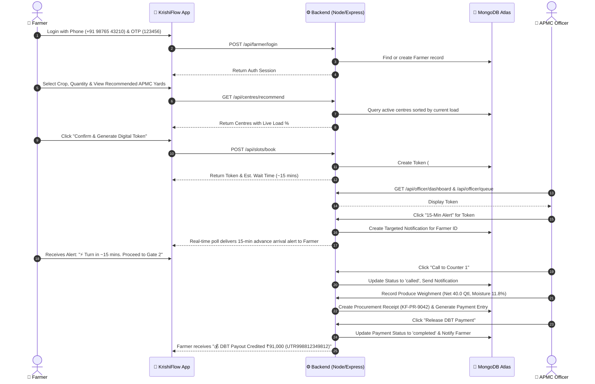

# 🌾 KrishiFlow (KisanFlow)
> **Smart APMC Procurement & Farmer Queue Management System**  
> *Government of Karnataka • Department of Agricultural Marketing & Co-operation*


## 📌 Problem Statement & Core Solution

### ⚠️ The Problem
Farmers across APMC yards face critical logistical challenges:
1. **Unpredictable Capacity**: Farmers don't know which procurement centre is overcrowded vs. available.
2. **Uncertain Arrival & Long Wait Times**: Farmers arrive blindly and wait up to **4 to 6 hours** in long physical queues with their loaded produce vehicles.
3. **Lack of Procurement & Payout Transparency**: Farmers lack real-time visibility into produce weighment, moisture quality grading, MSP rate calculations, and Direct Benefit Transfer (DBT) bank credits.

### 💡 The KrishiFlow Solution
KrishiFlow provides an intelligent end-to-end digital procurement platform:
- **Intelligent Centre Recommendation**: Analyzes live APMC yard capacities (`22% Low Load`, `45% Moderate`, `78% High Load`) and recommends the least congested yard.
- **Dynamic Digital Token Generation**: Allocates digital queue tokens (`#101`, `#102`, `#103`) with estimated wait times and gate entry slots.
- **15-Minute Advance Arrival Alert**: Officers send targeted SMS & In-App notifications to farmers ~15 minutes before their turn, preventing congestion at APMC entry gates.
- **Weighbridge & MSP Ledger**: Digitizes produce weighment (Gross / Tare / Net Kg), moisture sensor grading (FAQ Grade A/B/C), and MSP valuation.
- **Direct Benefit Transfer (DBT)**: Direct Aadhaar-linked bank payout credit tracking with UTR transaction references.

---

## 🚀 Key Features

### 🚜 Farmer Portal (Mobile & Desktop Responsive)
- **Phone Number & 6-Digit OTP Login**: Simple access using 10-digit mobile numbers (`+91 98765 43210`) with quick demo auto-fill.
- **Smart APMC Slot Booking**: Multi-step booking with crop selection (Wheat, Rice, Sugarcane, Cotton, Maize), quantity input in Quintals, and live load indicator bars.
- **Live Digital Token & 4-Stage Queue Tracker**: Visual stage progress tracker (`In Queue` → `Called to Counter` → `Weighbridge Verification` → `Completed`) with live position countdowns.
- **Real-Time Targeted Alerts Feed**: Receives instant notifications when a slot is booked, when the officer sends a **15-minute advance arrival notice**, when the token is called to Counter 1, or when DBT payment is deposited.
- **DBT Bank Payout Ledger**: Aadhaar-seeded bank account credit tracking (`State Bank of India •••• 9842`), UTR numbers, and digital receipts.
- **Multi-Device Responsive UI**: Native mobile tab navigation for phones, adaptive grids for tablets, and full-width ambient dashboards for laptops/desktops.

### 👮 Officer & APMC Management Portal
- **Protected Government Access Gate**: Secure login screen (`/officer/login`) requiring Government Badge ID and Official Security PIN (Default PIN: `4819`).
- **Live Overview Dashboard**: Auto-polling KPI cards (Total Registered Farmers, Today's Bookings, Active Queue, Completed Today), hourly token volume charts, and active queue tickers.
- **Registered Farmers Directory**: Detailed list of registered farmers with verification badges, land details, and a **Farmer Deep Dossier Inspector** showing lifetime bookings, produce weighments, and DBT earnings.
- **Live Queue Control Panel**:
  - `Call Next Token`: Promotes the next waiting farmer to Counter 1 and sends an automated alert.
  - `15-Min Alert`: Dispatches a targeted 15-minute advance arrival notice to a specific farmer.
  - `Mark Arrived / Processing`: Updates status to active weighbridge verification.
  - `Mark Complete`: Concludes procurement, decrements APMC load, and triggers DBT payout initiation.
- **Produce Weighbridge Ledger**: Complete weighment entry form (Gross/Tare/Net Kg), moisture content %, quality grade selection (FAQ Grade A, B, C, Rejected), MSP rate auto-calculation, and digital receipt creation (`KF-PR-XXXX`).
- **DBT Disbursement Center**: Direct Aadhaar bank transfer ledger with 1-click **"Release DBT"** disbursement button.
- **Departmental Intelligence & Analytics Reports**: Weekly intake vs. APMC quota bar charts, peak hour turnaround curves, crop-wise volume share pie charts, and CSV report export.
- **APMC Centre Management & Settings**: Register new procurement centres, set daily capacities, toggle active/inactive status, and configure officer profile preferences.

---

## 🔄 End-to-End System Workflow



---

## 🛠️ Technology Stack

### 💻 Frontend Architecture
| Technology | Description |
| :--- | :--- |
| **React 18.3** | UI component architecture with concurrent rendering |
| **Vite 5.4** | Next-generation fast frontend build tool & HMR dev server |
| **TypeScript 5.5** | Strictly-typed component props, state, and API payload definitions |
| **TailwindCSS 3.4** | Utility-first CSS framework with custom design tokens |
| **Framer Motion** | Micro-interactions, slide transitions, and modal animations |
| **Recharts** | Responsive SVG charts (Area charts, Bar charts, Pie charts) |
| **Lucide React** | Modern vector icon set |
| **React Router v6** | Client-side routing with lazy-loaded code splitting |
| **React Hot Toast** | Toast notifications for user feedback |

### ⚙️ Backend Architecture
| Technology | Description |
| :--- | :--- |
| **Node.js 18.x** | Asynchronous JavaScript runtime engine |
| **Express.js 4.x** | RESTful API web application framework |
| **MongoDB Atlas** | Cloud NoSQL Database storing Farmers, Tokens, Centres, Procurement Receipts & Payments |
| **Mongoose 8.x** | Object Data Modeling (ODM) library for MongoDB |
| **Nodemon** | Auto-restarting development server |

---

## 📂 Project Directory Structure

```
KisanFlow/
├── backend/
│   ├── config/              # MongoDB connection setup
│   ├── controllers/         # Core business logic (farmerController.js)
│   ├── models/              # Mongoose Schemas
│   │   ├── Centre.js        # APMC Procurement Centre Schema
│   │   ├── Farmer.js        # Registered Farmer Profile Schema
│   │   ├── Notification.js  # Targeted & Broadcast Alerts Schema
│   │   ├── OfficerProfile.js# Officer Profile & APMC Settings Schema
│   │   ├── Payment.js       # DBT Direct Bank Transfer Schema
│   │   ├── Procurement.js   # Produce Weighment & MSP Receipt Schema
│   │   └── Token.js         # Digital Queue Token Schema
│   ├── routes/
│   │   └── api.js           # REST API Route Declarations
│   ├── .env                 # Environment Variables (MONGO_URI, PORT)
│   ├── package.json         # Backend Dependencies
│   └── server.js            # Express Server Entry Point
│
└── frontend/
    ├── src/
    │   ├── app/             # Application shell & layout wrappers
    │   ├── components/      # Reusable UI Components
    │   │   ├── FarmerLayout.tsx   # Responsive Farmer Shell & Header
    │   │   ├── OfficerLayout.tsx  # Dark Responsive Officer Sidebar & Layout
    │   │   └── ui.tsx             # Shared Buttons, Cards, Modals, Badges & Skeletons
    │   ├── context/
    │   │   └── AuthContext.tsx    # Farmer Authentication State Provider
    │   ├── hooks/
    │   │   └── useOnlineStatus.ts # Offline/Online Network Detector
    │   ├── lib/
    │   │   └── api.ts             # Axios HTTP Client & API Helper Methods
    │   ├── pages/
    │   │   ├── farmer/            # Farmer Portal Screens
    │   │   │   ├── BookSlot.tsx           # Multi-step APMC Slot Booking
    │   │   │   ├── Home.tsx               # Farmer Dashboard & MSP Price Ticker
    │   │   │   ├── Login.tsx              # Phone + 6-Digit OTP Login
    │   │   │   ├── Notifications.tsx      # Real-Time Alerts & Calling Feed
    │   │   │   ├── Payments.tsx           # DBT Direct Bank Credit Ledger
    │   │   │   ├── ProcurementStatus.tsx  # Produce Weighment Receipts
    │   │   │   └── Profile.tsx            # Farmer Profile & Language Switcher
    │   │   └── officer/           # Officer & Admin Portal Screens
    │   │       ├── Centres.tsx            # APMC Centre Management & Add Centre Form
    │   │       ├── Dashboard.tsx          # Real-Time Live Overview & KPIs
    │   │       ├── Farmers.tsx            # Farmers Directory & Deep Profile Inspector
    │   │       ├── Login.tsx              # Government Officer Access Gate (PIN: 4819)
    │   │       ├── Notifications.tsx      # Broadcast Alert Composer & Log
    │   │       ├── Payments.tsx           # DBT Disbursement Ledger
    │   │       ├── Procurement.tsx        # Weighbridge Entry & MSP Calculation
    │   │       ├── Queue.tsx              # Live Queue Control & 15-Min Alerts
    │   │       ├── Reports.tsx            # Departmental Analytics & CSV Export
    │   │       └── Settings.tsx           # Officer Profile & APMC Preferences
    │   ├── App.tsx          # App Router Configuration
    │   ├── index.css        # Custom CSS & Tailwind Imports
    │   └── main.tsx         # React App Entry Point
    ├── index.html           # Main HTML Template
    ├── package.json         # Frontend Dependencies
    └── vite.config.ts       # Vite Configuration
```

---

## 📦 How to Run This Project from a ZIP File

If you received this project as a **ZIP file** (`KisanFlow.zip`), follow these simple steps to run the complete product on your computer:

### 1️⃣ Step 1: Extract the ZIP File
1. Right-click `KisanFlow.zip` and select **Extract All...** (or unzip using WinRAR/7-Zip).
2. Open the extracted **`KisanFlow`** folder in your terminal or IDE (VS Code).

### 2️⃣ Step 2: Install Prerequisites
Ensure you have **Node.js** (v18 or higher) installed on your machine:
- Download Node.js from [nodejs.org](https://nodejs.org) if not already installed.

### 3️⃣ Step 3: Commands to Execute

#### Option A: Running with Two Terminal Windows (Recommended)
Open two terminal windows in the extracted `KisanFlow` directory:

* **Terminal 1 — Backend (Express API & MongoDB Atlas)**:
  ```bash
  cd backend
  npm install
  npm run dev
  ```
  *(Backend will run on `http://localhost:5000` and connect automatically to MongoDB Atlas).*

* **Terminal 2 — Frontend (React 18 + Vite)**:
  ```bash
  cd frontend
  npm install
  npm run dev
  ```
  *(Frontend Vite dev server will run on `http://localhost:5173`).*

#### Option B: Unified Single-Command Setup
From the root `KisanFlow` directory:
```bash
npm run install:all
npm run start
```

---

### 4️⃣ Step 4: Step-by-Step Walkthrough to Test the Product

Once both servers are running, open your web browser at **`http://localhost:5173`**:

#### 🚜 Testing the Farmer Portal:
1. Navigate to [`http://localhost:5173/login`](http://localhost:5173/login).
2. Click **"⚡ Use Demo Account"** (Email: `farmer@krishiflow.com` / Password: `farmer123`).
3. Click **"Book Procurement Slot"**: Select crop (e.g. Wheat), enter weight (e.g. 50 Qtl), select an APMC yard based on live load %, and click **"Confirm & Book Slot"**.
4. View your **Live Digital Token (#101)** with wait time countdown & 4-stage queue tracker.
5. Check **Alerts & Notifications**: Inspect real-time 15-minute advance SMS alerts & DBT payment ledger!

#### 👮 Testing the Officer & APMC Admin Portal:
1. Navigate to [`http://localhost:5173/officer/login`](http://localhost:5173/officer/login).
2. Enter Official Credentials:
   - **Badge ID**: `AGRI-OFF-KA-4819`
   - **Security PIN**: `4819`
3. **Live Overview Dashboard**: View live KPI cards, hourly token volume charts, and active queue tickers.
4. **Live Queue Control Panel**: Click **"15-Min Alert"** to dispatch real-time SMS to the farmer, or click **"Call Next Token"** to promote tokens to Counter 1.
5. **Produce Weighbridge Ledger**: Input gross/tare/net weight, moisture %, FAQ grade, and calculate MSP payout.
6. **DBT Disbursement**: Click **"Release DBT"** to credit funds directly to the farmer's bank account.

---

## 🔑 Default Access Credentials for Testing

| Portal | URL | Demo Credentials |
| :--- | :--- | :--- |
| **Farmer Mobile & Web App** | [`http://localhost:5173/login`](http://localhost:5173/login) | **Email**: `farmer@krishiflow.com`<br/>**Password**: `farmer123` *(Or click "⚡ Use Demo Account")* |
| **Officer & APMC Admin Portal** | [`http://localhost:5173/officer/login`](http://localhost:5173/officer/login) | **Badge ID**: `AGRI-OFF-KA-4819`<br/>**Security PIN**: `4819` |

---

## 📄 API Reference Summary

### 🌾 Farmer Endpoints (`/api`)
- `POST /api/farmer/login` — Phone authentication & farmer registration.
- `GET /api/centres/recommend` — Recommends APMC centres sorted by least load %.
- `POST /api/slots/book` — Reserves a procurement slot & generates digital token.
- `GET /api/slots/active/:farmerId` — Retrieves active token status & queue position.
- `GET /api/farmer/notifications/:farmerId` — Fetches real-time alerts for a specific farmer.
- `GET /api/farmer/payments/:farmerId` — Fetches DBT payment transactions for a farmer.
- `GET /api/farmer/procurements/:farmerId` — Fetches produce weighment receipts for a farmer.

### 👮 Officer Endpoints (`/api/officer`)
- `GET /api/officer/dashboard` — Returns live KPIs (Total Farmers, Today's Bookings, Active Queue, Completed Today) & hourly chart data.
- `GET /api/officer/queue` — Retrieves active queue tokens with status filters.
- `POST /api/officer/queue/call-next` — Promotes next waiting token to 'called'.
- `POST /api/officer/token/:tokenId/advance-alert` — Dispatches 15-minute advance arrival notice.
- `PUT /api/officer/token/:tokenId/status` — Updates token status (`called`, `processing`, `completed`, `cancelled`).
- `GET /api/officer/farmers` — Directory of all registered farmers.
- `GET /api/officer/farmers/:farmerId` — Deep profile inspector (dossier, history, payments).
- `POST /api/officer/farmers/:farmerId/notify` — Sends targeted notification to a single farmer.
- `GET /api/officer/procurements` & `POST /api/officer/procurements` — View and record produce weighment entries.
- `GET /api/officer/payments` & `POST /api/officer/payments/:paymentId/disburse` — Manage & disburse DBT bank payments.
- `GET /api/officer/reports` — Departmental analytics & volume reports.
- `GET /api/officer/profile` & `PUT /api/officer/profile` — Officer profile and APMC preferences.

---

## 🌐 Production Deployment Guide

### Option 1: Monolithic Deployment (Render / Railway)
Deploy both Express backend and React frontend bundled together as a single service on **Render** or **Railway**:
1. Connect your GitHub repository to [Render.com](https://render.com).
2. Create a new **Web Service**.
3. Set Build Command: `npm run install:all && npm run build`
4. Set Start Command: `npm start`
5. Add Environment Variables:
   - `PORT`: `5000`
   - `MONGODB_URI`: `mongodb+srv://...`

### Option 2: Split Deployment (Vercel + Render)
- **Backend**: Deploy `/backend` to Render, Railway, or AWS.
- **Frontend**: Deploy `/frontend` to Vercel or Netlify.
  - Set Environment Variable in Vercel: `VITE_API_URL` = `https://your-backend-api.onrender.com`

---

## 📜 License & Copyright
© 2026 **KrishiFlow** — Department of Agricultural Marketing, Govt. of Karnataka. All rights reserved.